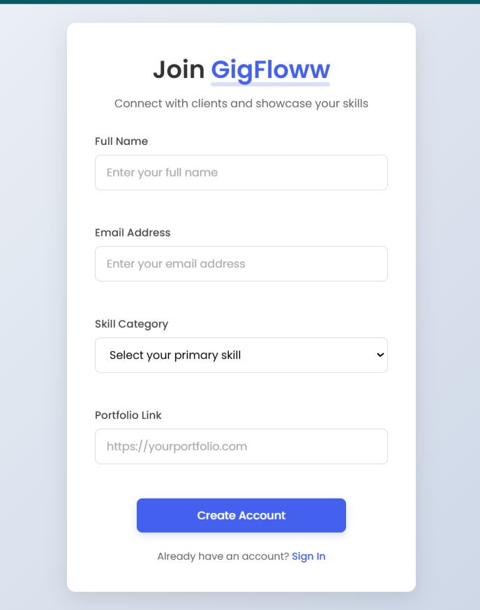

# 🚀 GigFloww - Sign-Up Form & Button Component Library

A simple, responsive sign-up page for gig workers with input validation and a reusable button component set. Built as part of an assignment task.

## 🌐 Live Demo

👉 [View Live Project](https://gigfloww-form-assignment.netlify.app/)

## 📸 Preview

 
---

## ✨ Features

### 🔹 Sign-Up Form
- Input Fields: **Name**, **Email**, **Skill Category**, **Portfolio Link**
- HTML5 & JavaScript Validation
- Success message on submission
- Responsive layout with clean UI

### 🔹 Button Component Library
- 🔵 **Primary Button**
- ⚪ **Secondary Button**
- 🚫 **Disabled Button**
- Hover & Active States

---

## 🛠️ Tech Stack

- **HTML5**
- **CSS3**
- **JavaScript (Vanilla)**
- Responsive design using Flexbox

---

